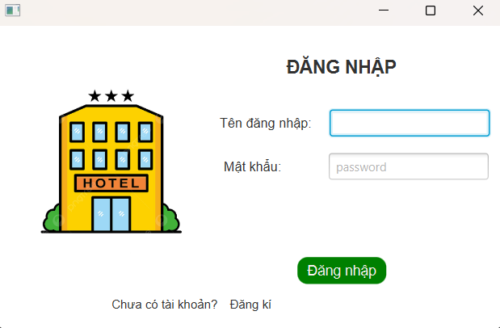
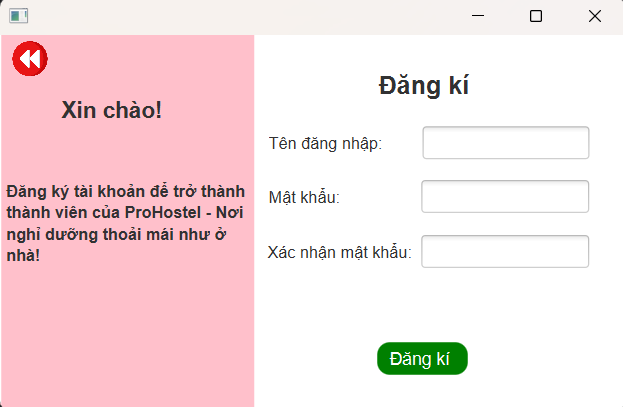
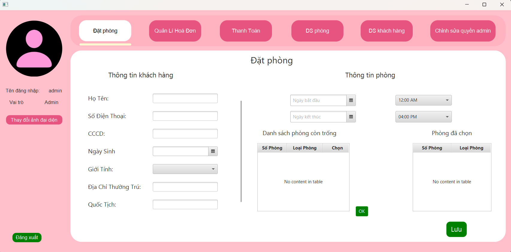
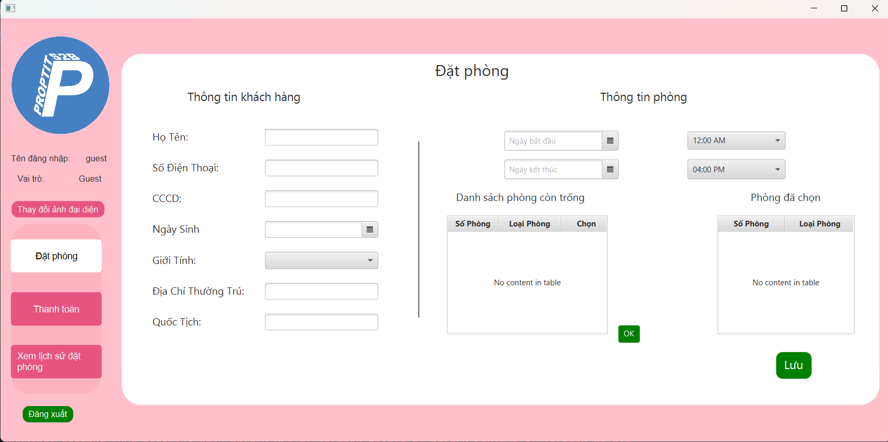

### QUẢN LÍ KHÁCH SẠN - PROHOSTEL
---

### 📚 Nội dung
- [QUẢN LÍ KHÁCH SẠN - PROHOSTEL](#quản-lí-khách-sạn---prohostel)
- [📚 Nội dung](#-nội-dung)
  - [1. Cấu trúc thư mục](#1-cấu-trúc-thư-mục)
  - [2. Tính năng](#2-tính-năng)
  - [3. Ảnh chụp màn hình](#3-ảnh-chụp-màn-hình)
  - [4. Video demo sản phẩm](#4-video-demo-sản-phẩm)
  - [5. Tác giả](#5-tác-giả)
---
#### 1. Cấu trúc thư mục
    ProHostel/
    ├── src
    |    └── main
    |        ├── java
    |        |    └── org.example.prohostel
    |        |        ├── Model
    |        |        |    ├── Booking.java
    |        |        |    ├── GuestManager.java
    |        |        |    ├── Invoice.java
    |        |        |    └──....
    |        |        ├── AdminHome.java
    |        |        ├── BookingRoom.java
    |        |        ├── CheckoutPayment.java
    |        |        ├── GuestHome.java
    |        |        └──...
    |        └── resources
    |            ├── Image
    |            └── org.example.prohostel
    |                ├── AdminHome.fxml
    |                ├── BookingRoom.fxml      
    |                ├── GuestHome.fxml
    |                └──...
    ├── Accounts.dat
    ├── avatar_sources.txt
    ├── Guests.dat
    ├── Invoices.dat
    └── Rooms.dat

#### 2. Tính năng
- Đối với tài khoản admin:
    + Đặt phòng.
    + Thanh toán.
    + Xem danh sách khách hàng.
    + Xem danh sách hoá đơn.
    + Xem danh sách phòng, thêm, sửa, xoá phòng.
    + Cấp quyền, huỷ quyền admin cho tài khoản khác.
- Đối với tài khoản khách hàng:
    + Đặt phòng
    + Thanh toán online
    + Xem lịch sử đặt phòng của tài khoản
#### 3. Ảnh chụp màn hình
a) Đăng nhập

b) Đăng kí

c) Màn hình tài khoản Admin

d) Mà hình tài khoản khách hàng

#### 4. Video demo sản phẩm

#### 5. Tác giả
- Văn Thị Mai Linh 
